# Self-Learning Agent — Architecture

This document describes how the agent works end-to-end. All diagrams
are [Mermaid](https://mermaid.js.org/) — they render natively on GitHub.
For local viewing, paste any block into the [Mermaid Live Editor](https://mermaid.live).

> **Source of truth.** When this doc and the code disagree, the code wins.
> Treat this as a map, not a contract — keep it in sync when you ship
> structural changes (new pipeline branch, new memory store, new LLM call site).

---

## 1. Overview

The agent is a single-process Python service that turns a user message
into a verified answer, while learning from every turn. It exposes:

- A **WebUI** (React + FastAPI SSE chat).
- A **Telegram bot** (long-poll, real-time progress streaming).
- A **REST API** under `/api/*` for status, attachments, knowledge,
  goals, sessions, providers, etc.

Reasoning lives in a **dual-model router** (Claude as model A,
Qwen / Ollama as model B). Memory is layered: **CORE** (always-on),
**KNOWLEDGE GRAPH** + **NOTES** (semantic + structured), **CONVERSATION**
(short-term sliding window), **ATTACHMENTS** (sha-deduped images / voice
/ files).

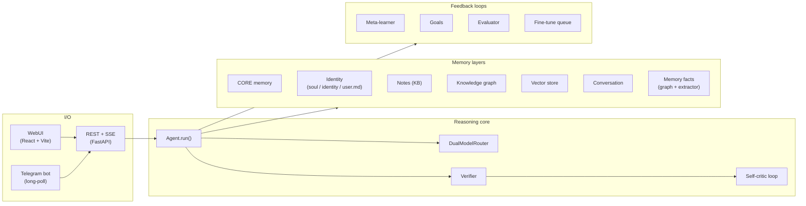

---

## 2. Request lifecycle (`Agent.run`)

Every chat message — WebUI or Telegram — runs through the same pipeline.
After classification it splits into one of three branches: `chat`,
`preference`, or `task`. Only the `task` branch goes through the full
think → solve → verify cycle.

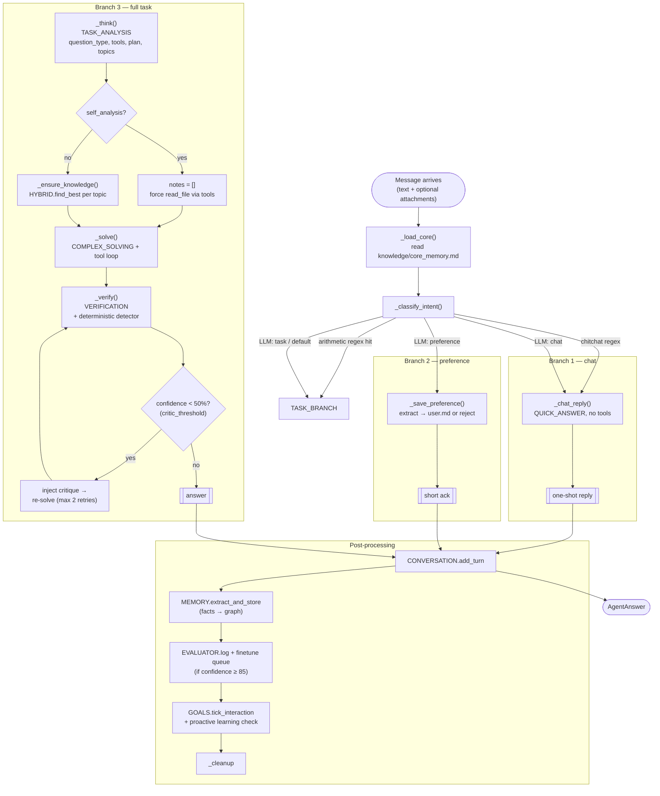

### Branch decisions

| Branch | Trigger | What runs | Confidence |
|---|---|---|---|
| `chat` | regex chitchat OR classifier says "chat" | `_chat_reply` (1 LLM call, no tools) | always 100 |
| `preference` | classifier says "preference" | `_save_preference` (extractor + write to `user.md`) | always 100 |
| `task` | arithmetic regex OR classifier says "task" OR default | `_think → _ensure_knowledge → _solve → _verify → critic loop` | computed |

---

## 3. Identity preamble

Every chat / think / solve LLM call gets the same identity preamble at
the top of its system prompt. The order matters — `LANGUAGE OVERRIDE`
and `AGENT NAME OVERRIDE` are appended LAST so they outweigh any
conflicting rule from `# SOUL`.

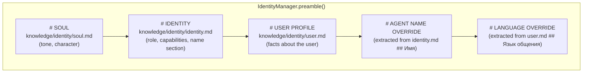

`LANGUAGE OVERRIDE` and `AGENT NAME OVERRIDE` are only emitted when their
source sections are non-empty. Soul-level rules (e.g., "mirror the user's
language") become defaults — overrides win on conflict because they're
positioned at the end of the preamble where attention weight peaks.

---

## 4. Per-turn user-message context

`_shared_context(task, core)` builds the per-turn block that sits BELOW
identity in the user message. Stable facts come first, ephemeral state
last:

```
# CORE MEMORY        ← long-term persistent facts
# CURRENT PROJECT    ← active workspace, if any
# GOALS              ← top N active goals
# SHORT-TERM MEMORY  ← semantic recall vs. current task
                       (REPLACED by # RECENT COMMITS on self_analysis)
# RECENT TURNS       ← last N conversation turns
```

**Self-analysis rewrite.** When `thinking.question_type == "self_analysis"`:

- `MEMORY.recall_block` is **dropped** — it's a snapshot of past
  observations and reproduces stale findings.
- `git log --oneline -50` is added as `# RECENT COMMITS` so the agent
  knows what its code looks like *now*.
- `_ensure_knowledge` is **bypassed entirely** — KB notes about the
  code are also snapshots; the only authoritative source is the file
  on disk via `read_file`.

This rewrite was the fix for the "agent finds bugs that were already
fixed last commit" pattern.

---

## 5. Memory hierarchy

The agent has five distinct stores, each with its own retrieval
strategy and lifetime:

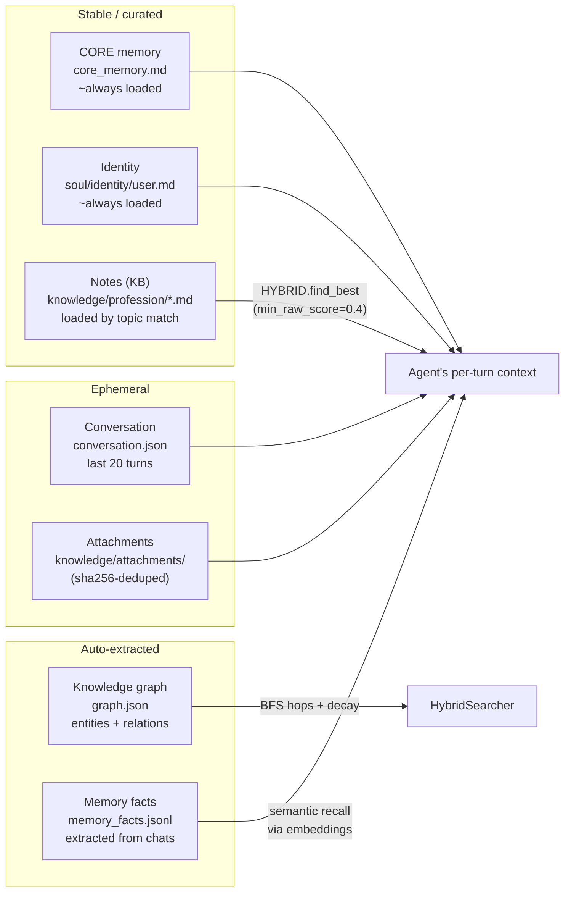

**Hybrid search** combines three signals when looking up a topic:
fuzzy keyword (rapidfuzz, threshold 0.6), graph traversal (BFS with
`graph_score_floor=0.10`), vector cosine (embedder, `vector_score_floor=0.30`).
When a signal is unavailable, weights re-normalize across the
remaining ones. Below the per-signal raw floor → noise → dropped.

---

## 6. LLM router

`DualModelRouter` picks model A (Claude / cloud) vs. model B
(Qwen / local) per `TaskType`. Defaults can be shifted by schedule
or by daily budget; `VERIFICATION` is always pinned to A.

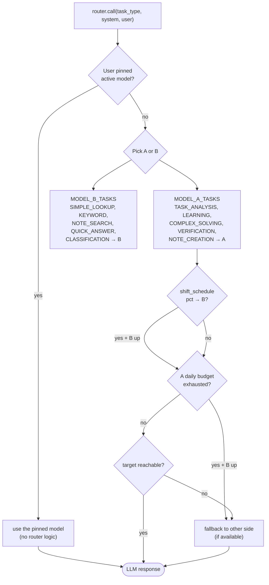

**Provider-agnostic.** Both A and B are configured through
`backend/providers.py`. A can be Anthropic, Codex (OpenAI ChatGPT
subscription), Bedrock, Cohere, Copilot, or any
OpenAI-compatible endpoint. B defaults to `llama-server` /
Ollama on `100.124.210.21:8015`-ish.

---

## 7. Tool loop

`COMPLEX_SOLVING` calls go through `complete_with_tools`. The model
emits `text + tool_use` blocks; the agent executes each tool and
re-feeds results until the model returns text without further
tool calls — or hits `max_iterations=6`.

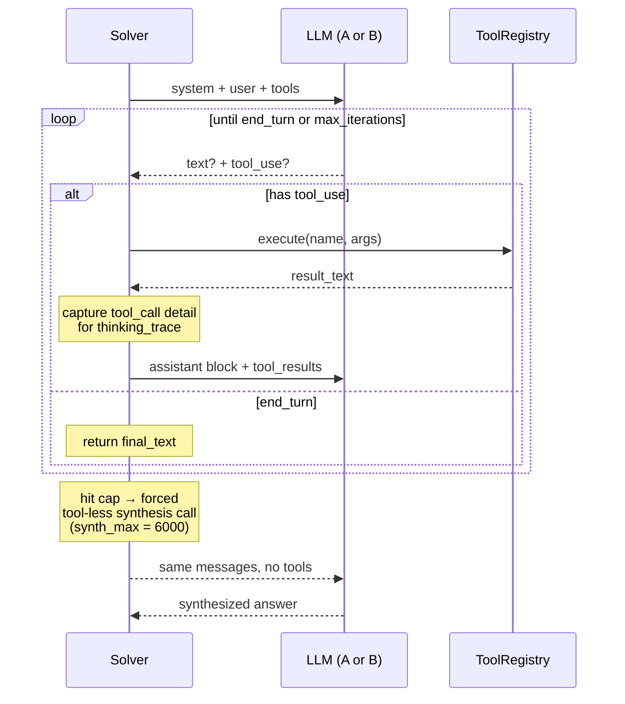

**Why the forced synthesis at max-iterations.** Anthropic models
emit `text + tool_use` in the same turn — the text is "preamble"
narration ("Now I will check the source"), not a final answer. If
we returned the last preamble, the user would see a promise-of-action
instead of an answer. The forced synthesis call drops `tools` and
asks for a real answer.

**`final_text` capture rule.** Only when there are NO tool_uses in the
response, otherwise we'd treat the preamble as the answer.

---

## 8. Verifier + self-critic loop

Verification pings the LLM (always model A) with the answer + notes +
tool outputs and asks it to bucket every claim. Confidence is computed
**deterministically in Python** from the bucket counts:

```
confidence = 100 × verified / (verified + unverified + 2 × contradictions)
```

Contradictions weight 2× because they're evidence *against*, not just
absent evidence. Then the result passes through a deterministic
false-absence detector — a regex sweep that catches "add X" / "missing X"
when X is in `EXTRACTED IDENTIFIERS` from tool output. Any hit is
promoted to a contradiction. This is belt-and-suspenders for the
LLM-side rule because Sonnet has been observed missing these even
with explicit prompt guidance.

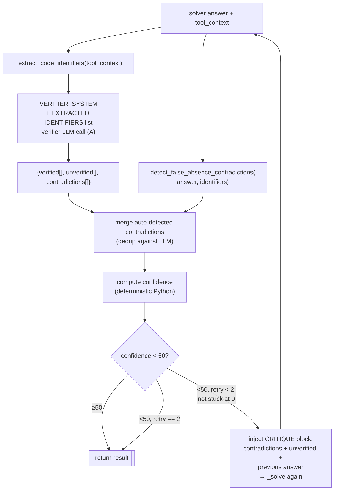

**Stop conditions:**

- Confidence ≥ `critic_threshold` (50%) → done.
- `retry == max_retries` (2) → done with whatever we have.
- Confidence stuck at 0% across two iterations → break (signal it's
  a structural problem, more retries won't help).
- `LLMError` mid-retry → break, return current best.

**Skip path.** For `question_type ∈ {"creative", "meta", "self_analysis"}`
*without* tool_context, verification is skipped entirely (there's
nothing to verify against — the verifier would just produce
unverified-noise).

---

## 9. Identifier extraction (verifier helper)

The detector and the LLM verifier both rely on a list of identifiers
present in the source code at this turn. Pre-extraction makes the
"already in code" check a keyword match instead of a 12k-char read.

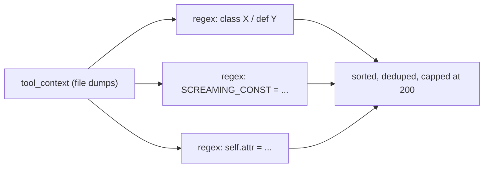

The detector then normalises both candidate (from answer) and
identifier (from extraction) via `s.replace("_", "").lower()`, so
`FILE_CACHE` ↔ `_file_cache` ↔ `fileCache` collapse to the same key.

---

## 10. Feedback loops

Two loops run in the background and shape future behaviour:

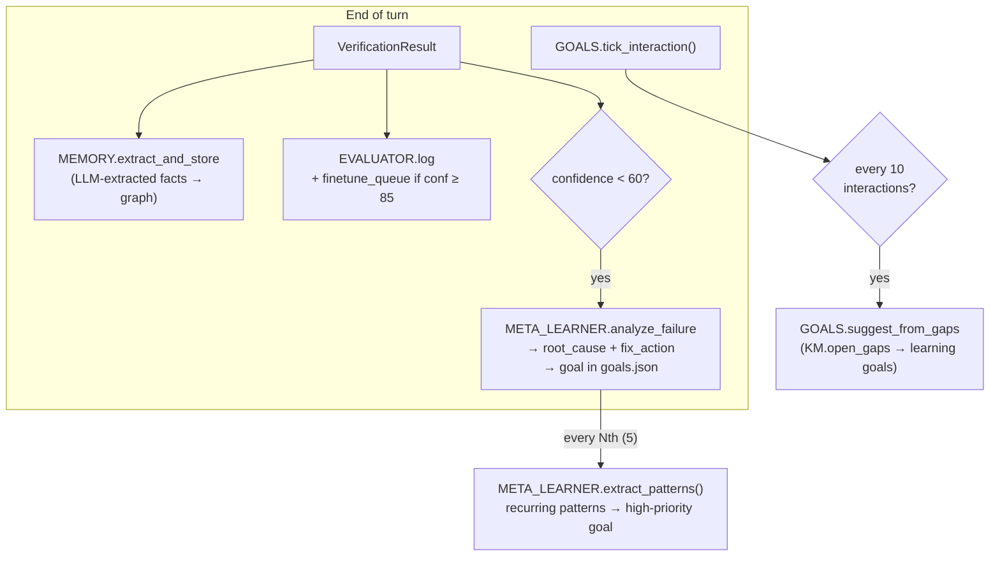

**Goals dedup.** All goal-creation paths normalize description through
`re.sub(r'\W+', ' ', s.lower()).strip()`, so punctuation/whitespace
variants of the same goal collapse. Distinct topics stay distinct.

**Auto-fix actions** that meta-learner can take based on failure
analysis:

- `learn_topic` → goal "Learn: \<topic\>" priority ≤ severity
- `add_core_fact` → goal to add a fact to `core_memory.md`
- `update_note` → goal to refresh an existing KB note
- `improve_prompt` → goal flagged as prompt engineering work

---

## 11. Channels — WebUI vs Telegram

Both go through the same `Agent.run()`. They differ only in transport
and progress UX.

**WebUI (`/api/chat`)** — Server-Sent Events:


**Telegram (`backend/channels.py`)** — placeholder + edit-in-place:

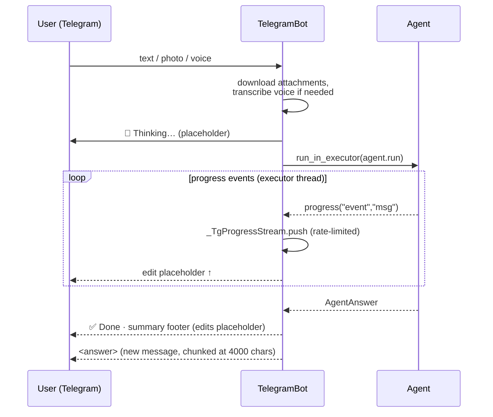

The placeholder edit is throttled to one per ~1.2s (Telegram rate
limit) and coalesces bursts into a single deferred flush.

---

## 12. Self-modifier (gated)

Optional path: the agent can analyse its own modules and propose
patches, but **never applies them without explicit user approve**.

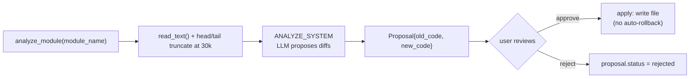

This module is read-only by default — `apply()` only runs on explicit
user action via the WebUI.

---

## 13. Useful entry points (file:line cheatsheet)

| Want to find | Look at |
|---|---|
| Pipeline entry | `backend/agent.py:Agent.run` |
| Intent classifier | `backend/agent.py:_classify_intent` |
| Thinking step | `backend/agent.py:_think` |
| Solver + tool loop call | `backend/agent.py:_solve` |
| Verification + critic loop | `backend/agent.py:run` (search `critic_threshold`) |
| Self-analysis context rewrite | `backend/agent.py:_shared_context` (look for `for_self_analysis`) |
| Identity preamble assembly | `backend/identity.py:IdentityManager.preamble` |
| Router selection | `backend/llm.py:DualModelRouter._pick` |
| Tool loop (Anthropic) | `backend/llm.py:AnthropicLLM.complete_with_tools` |
| False-absence detector | `backend/verifier.py:detect_false_absence_contradictions` |
| Hybrid search | `backend/hybrid_searcher.py:HybridSearcher.search` |
| Failure analysis + auto-extract | `backend/meta_learner.py:analyze_failure` |
| Goal dedup normalization | `backend/goals.py:_normalize_description` |
| Telegram realtime stream | `backend/channels.py:_TgProgressStream` |
| WebUI chat SSE | `backend/api/chat.py` |

---

*Last verified against commit `a8b0cbe`.*
