# Архитектура self-learning агента

Документ описывает, как агент устроен от и до. Все диаграммы —
[Mermaid](https://mermaid.js.org/), они рендерятся прямо в GitHub
без плагинов. Локально можно вставлять блоки в [Mermaid Live Editor](https://mermaid.live).

> **Источник истины — код.** Если документ и код расходятся — прав код.
> Документ — это карта, не контракт. Когда меняешь структуру (новая ветка
> в pipeline, новое хранилище памяти, новая точка вызова LLM) — обнови
> и здесь.

---

## 1. Обзор

Агент — однопроцессный Python-сервис, который принимает сообщение
пользователя и возвращает **проверенный** ответ, попутно учась
с каждого хода. Доступ:

- **WebUI** (React + FastAPI SSE-чат).
- **Telegram-бот** (long-poll, real-time стрим прогресса).
- **REST API** под `/api/*` — статус, аттачменты, knowledge,
  цели, сессии, провайдеры, и т.д.

Рассуждение живёт в **dual-model router** (Claude как модель A,
Qwen / Ollama как модель B). Память слоистая: **CORE** (всегда
в контексте), **knowledge graph + notes** (семантика + структура),
**conversation** (короткое sliding-window), **attachments**
(sha-deduped картинки / голос / файлы).

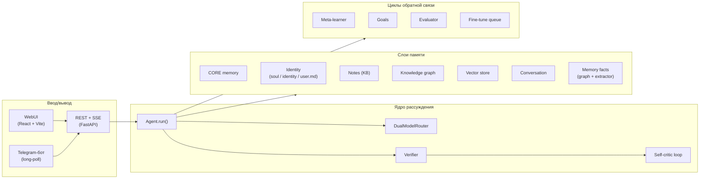

---

## 2. Жизненный цикл запроса (`Agent.run`)

Любое сообщение — из WebUI или Telegram — проходит через один и тот же
pipeline. После классификации — три ветки: `chat`, `preference`, `task`.
Только ветка `task` идёт в полный цикл think → solve → verify.

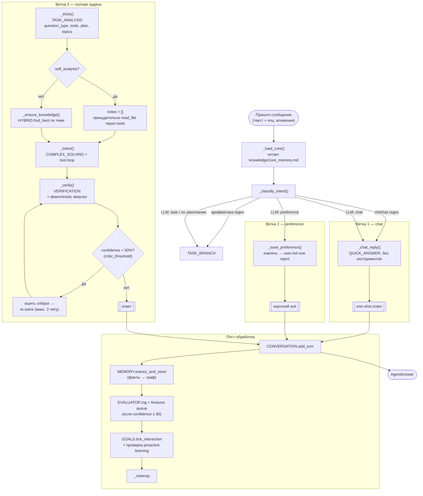

### Решение по веткам

| Ветка | Триггер | Что выполняется | Confidence |
|---|---|---|---|
| `chat` | regex chitchat ИЛИ классификатор сказал «chat» | `_chat_reply` (1 LLM-вызов, без tools) | всегда 100 |
| `preference` | классификатор сказал «preference» | `_save_preference` (extractor + запись в `user.md`) | всегда 100 |
| `task` | regex арифметики ИЛИ классификатор сказал «task» ИЛИ default | `_think → _ensure_knowledge → _solve → _verify → critic loop` | вычисляется |

---

## 3. Identity preamble

Каждый chat / think / solve LLM-вызов получает одинаковую identity-преамбулу
в начале system-промпта. Порядок важен: `LANGUAGE OVERRIDE` и
`AGENT NAME OVERRIDE` идут **последними**, чтобы перебить любое
конфликтующее правило из `# SOUL`.

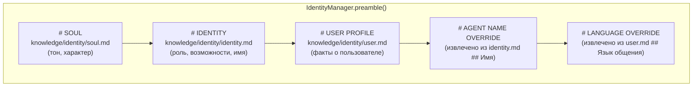

`LANGUAGE OVERRIDE` и `AGENT NAME OVERRIDE` рендерятся только если
их секции-источники непустые. Soul-уровневые правила («повторяй язык
пользователя») становятся **значениями по умолчанию** — overrides
выигрывают конфликт, потому что лежат в конце preamble, где вес
attention максимален.

---

## 4. Per-turn user message context

`_shared_context(task, core)` собирает блок per-turn, который ложится
ПОД identity в user-сообщение. Стабильные факты сверху, эфемерные снизу:

```
# CORE MEMORY        ← постоянные факты долгой памяти
# CURRENT PROJECT    ← активный workspace, если есть
# GOALS              ← топ N активных целей
# SHORT-TERM MEMORY  ← семантический recall под текущий запрос
                       (ЗАМЕНЯЕТСЯ на # RECENT COMMITS на self_analysis)
# RECENT TURNS       ← последние N реплик
```

**Перестроение для self-analysis.** Когда `thinking.question_type == "self_analysis"`:

- `MEMORY.recall_block` **выкидывается** — это снапшот старых
  наблюдений, он воспроизводит уже-исправленные находки.
- Вместо него добавляется `git log --oneline -50` в виде
  `# RECENT COMMITS` — агент видит, как код выглядит **сейчас**.
- `_ensure_knowledge` **полностью обходится** — KB-заметки про код
  тоже снапшоты; единственный авторитет — файл на диске через
  `read_file`.

Это лечит паттерн «агент находит баги, которые уже починены
последним коммитом».

---

## 5. Иерархия памяти

У агента пять разных хранилищ, у каждого своя стратегия извлечения
и время жизни:

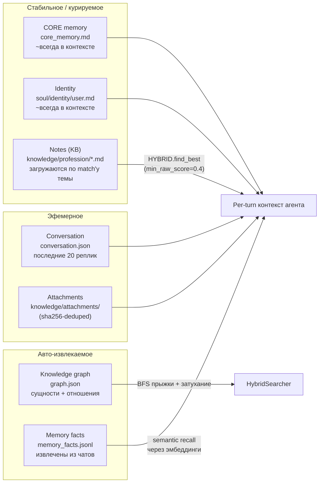

**Hybrid search** комбинирует три сигнала при поиске темы:
fuzzy keyword (rapidfuzz, threshold 0.6), graph traversal (BFS с
`graph_score_floor=0.10`), vector cosine (embedder, `vector_score_floor=0.30`).
Когда какой-то сигнал недоступен, веса перенормализуются по
оставшимся. Ниже сырого порога per-signal → шум → отбрасывается.

---

## 6. LLM router

`DualModelRouter` выбирает модель A (Claude / cloud) или B
(Qwen / local) per `TaskType`. Дефолты можно сместить расписанием
или дневным бюджетом; `VERIFICATION` всегда жёстко на A.

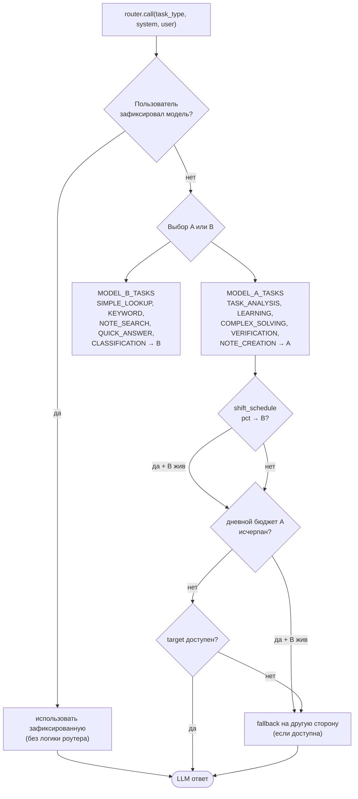

**Provider-agnostic.** A и B настраиваются через
`backend/providers.py`. A может быть Anthropic, Codex (OpenAI ChatGPT
subscription), Bedrock, Cohere, Copilot, или любой
OpenAI-совместимый endpoint. B по умолчанию — `llama-server` /
Ollama на `100.124.210.21:8015`-ish.

---

## 7. Tool loop

`COMPLEX_SOLVING` идёт через `complete_with_tools`. Модель эмитит
`text + tool_use` блоки; агент исполняет каждый инструмент и
возвращает результаты, пока модель не выдаст текст без новых
tool-вызовов — либо пока не упрёмся в `max_iterations=6`.

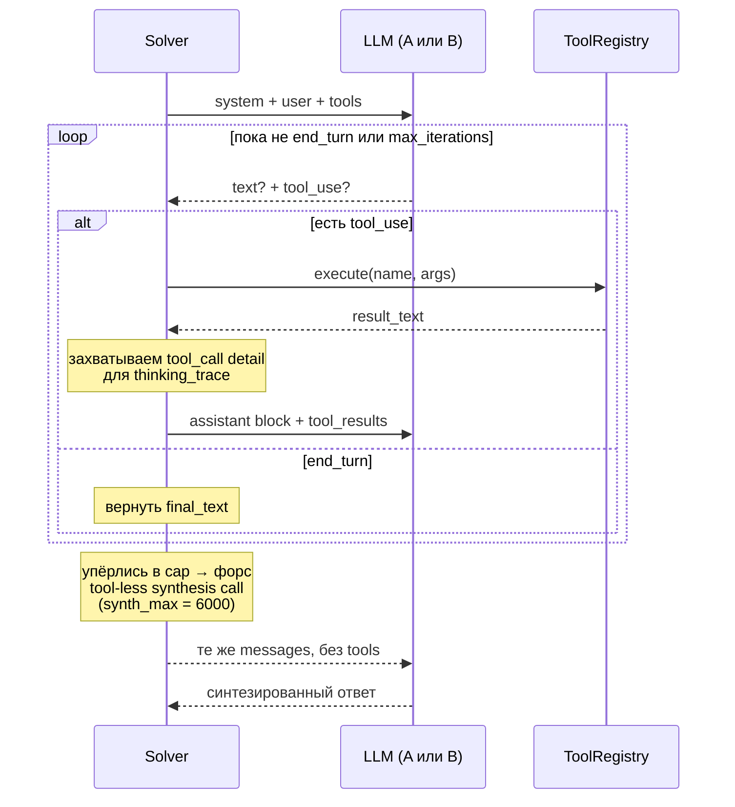

**Зачем форс-синтез на max-iterations.** Anthropic-модели эмитят
`text + tool_use` в одном ходу — этот текст это «преамбула»
(«сейчас я проверю источник»), не финальный ответ. Если вернуть
последнюю преамбулу — пользователь увидит обещание-действия,
а не ответ. Forced synthesis сбрасывает `tools` и просит реальный
ответ.

**Правило захвата `final_text`.** Только когда в ответе **нет**
tool_use блоков, иначе мы записали бы преамбулу как ответ.

---

## 8. Verifier + self-critic loop

Верификатор пингует LLM (всегда модель A) с ответом + заметками +
tool outputs и просит разнести каждый claim по корзинам. Confidence
вычисляется **детерминистически в Python** из счётчиков корзин:

```
confidence = 100 × verified / (verified + unverified + 2 × contradictions)
```

Contradictions весят 2× потому что это evidence *против*, а не
просто отсутствие доказательств. Дальше результат проходит через
deterministic false-absence detector — regex-проход, который ловит
«add X» / «missing X», когда X есть в `EXTRACTED IDENTIFIERS`,
извлечённых из tool output. Любое попадание — promote в
contradiction. Это belt-and-suspenders для LLM-правила, потому что
Sonnet наблюдался как пропускающий это даже при явных инструкциях.

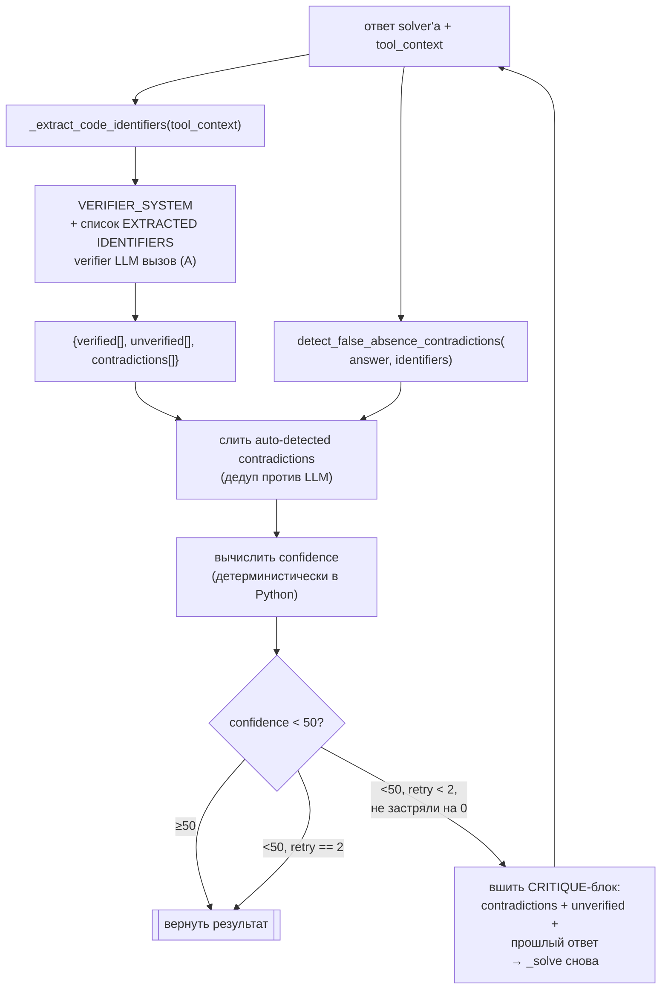

**Условия остановки:**

- `confidence ≥ critic_threshold` (50%) → готово.
- `retry == max_retries` (2) → отдаём что есть.
- Confidence застрял на 0% две итерации подряд → break (структурная
  проблема, retry не поможет).
- `LLMError` посреди retry → break, отдаём текущее лучшее.

**Skip path.** Для `question_type ∈ {"creative", "meta", "self_analysis"}`
*без* tool_context верификация полностью пропускается (нечего
проверять — верификатор просто наплодил бы unverified-шум).

---

## 9. Извлечение идентификаторов (helper для verifier)

И детектор, и LLM-верификатор оба опираются на список идентификаторов,
реально присутствующих в коде на этом ходу. Pre-extraction превращает
проверку «уже в коде» из «прочитай 12k символов» в keyword-match.

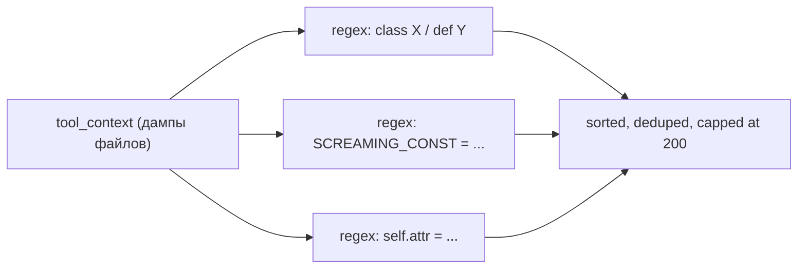

Дальше детектор нормализует и кандидата (из ответа), и идентификатор
(из извлечения) через `s.replace("_", "").lower()` — `FILE_CACHE` ↔
`_file_cache` ↔ `fileCache` схлопываются в один ключ.

---

## 10. Циклы обратной связи

Два цикла крутятся в фоне и формируют будущее поведение:

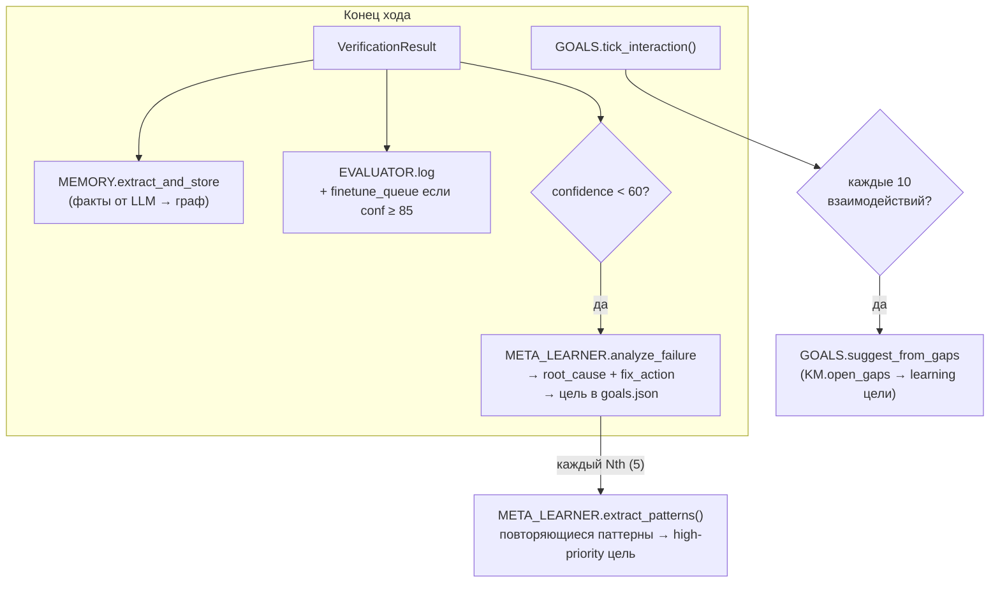

**Дедуп целей.** Все пути создания целей нормализуют описание через
`re.sub(r'\W+', ' ', s.lower()).strip()`, поэтому punctuation/whitespace
варианты одной цели схлопываются. Разные темы остаются разными.

**Auto-fix actions**, которые meta-learner может предпринять
по результатам анализа провала:

- `learn_topic` → цель «Learn: \<topic\>» приоритет ≤ severity
- `add_core_fact` → цель добавить факт в `core_memory.md`
- `update_note` → цель обновить существующую заметку KB
- `improve_prompt` → цель помечается как prompt engineering работа

---

## 11. Каналы — WebUI vs Telegram

Оба идут через один `Agent.run()`. Различаются только транспортом
и UX прогресса.

**WebUI (`/api/chat`)** — Server-Sent Events:

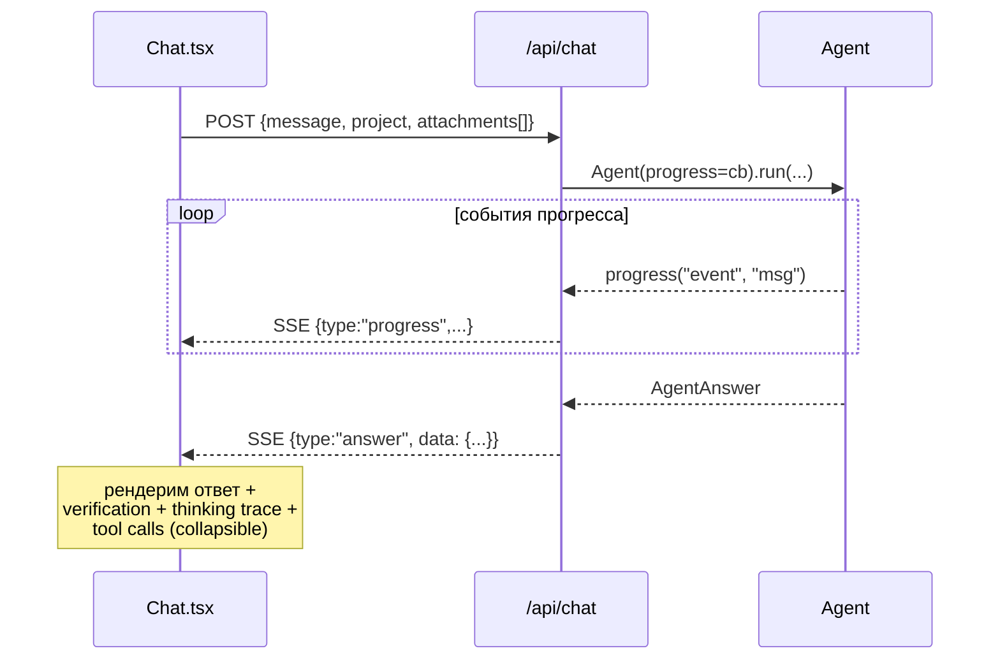

**Telegram (`backend/channels.py`)** — placeholder + edit-in-place:

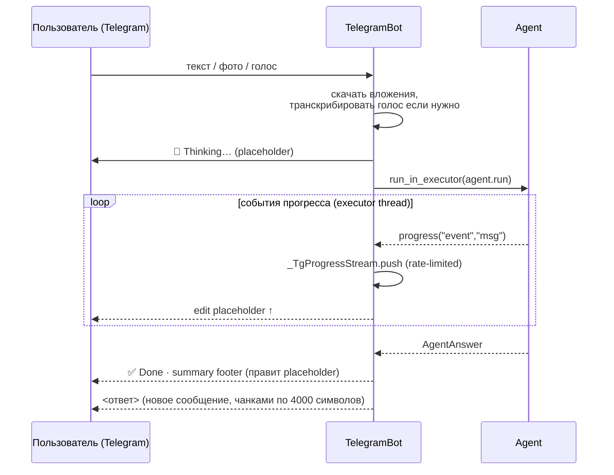

Edit placeholder'а throttled до одного per ~1.2s (Telegram rate
limit), и burst'ы coalesce в один отложенный flush.

---

## 12. Self-modifier (gated)

Опциональный путь: агент может анализировать свои собственные
модули и предлагать патчи, но **никогда не применяет их без явного
approve пользователя**.

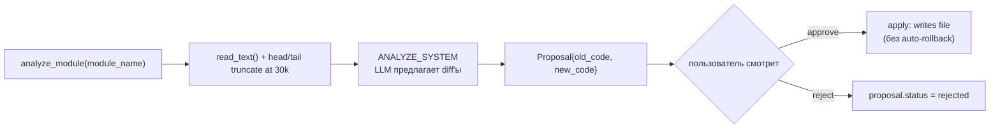

Этот модуль read-only по умолчанию — `apply()` срабатывает только
по явному действию пользователя через WebUI.

---

## 13. Полезные точки входа (file:line cheatsheet)

| Что найти | Где смотреть |
|---|---|
| Точка входа pipeline | `backend/agent.py:Agent.run` |
| Intent classifier | `backend/agent.py:_classify_intent` |
| Шаг thinking | `backend/agent.py:_think` |
| Solver + вызов tool loop'а | `backend/agent.py:_solve` |
| Verification + critic loop | `backend/agent.py:run` (искать `critic_threshold`) |
| Перестроение контекста для self-analysis | `backend/agent.py:_shared_context` (искать `for_self_analysis`) |
| Сборка identity preamble | `backend/identity.py:IdentityManager.preamble` |
| Выбор роутера | `backend/llm.py:DualModelRouter._pick` |
| Tool loop (Anthropic) | `backend/llm.py:AnthropicLLM.complete_with_tools` |
| Детектор false-absence | `backend/verifier.py:detect_false_absence_contradictions` |
| Hybrid search | `backend/hybrid_searcher.py:HybridSearcher.search` |
| Анализ провала + auto-extract | `backend/meta_learner.py:analyze_failure` |
| Нормализация дедупа целей | `backend/goals.py:_normalize_description` |
| Telegram realtime stream | `backend/channels.py:_TgProgressStream` |
| WebUI chat SSE | `backend/api/chat.py` |
| Dev mode redactor | `backend/dev_capture.py:redact_prompt` |

---

*Последний раз сверено с коммитом `0f934d6`.*
